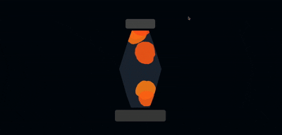

# Lava Lamp Simulation

🌋 **Live demo:**  
👉 https://melitasdsouza.github.io/cs44n-lava-lamp/

Organic lava-lamp–style animation created for **CS 44N: Creative Coding** at Stanford.

This project simulates rising, blobby forms using Perlin noise, constrained motion, and custom canvas clipping to mimic liquid behavior inside a glass lamp.

## Features
- Noise-driven organic blob motion
- Custom clipping path for lamp geometry
- Object-oriented blob system
- Continuous vertical cycling
- HSB color palette

## Technologies
- JavaScript
- p5.js
